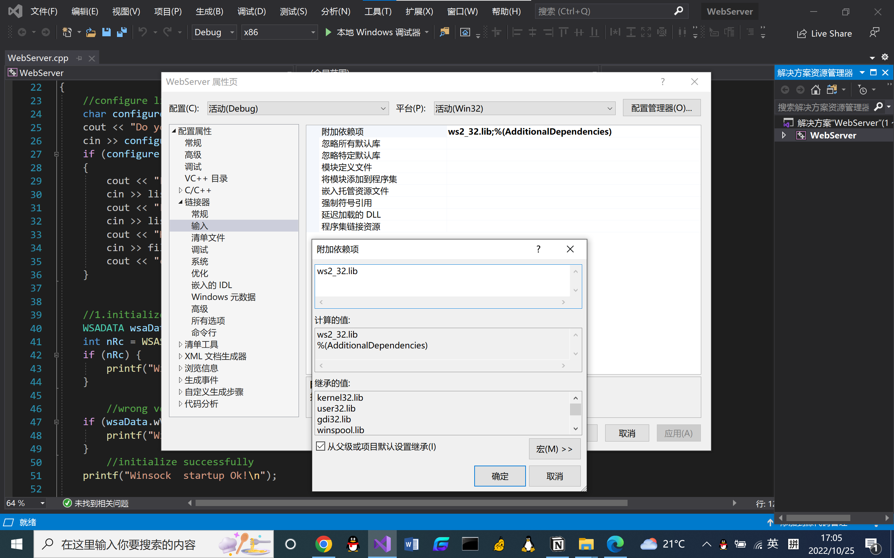

# WebServer-ipv4使用：

## 配置环境:

1. 创建控制台应用
2. 新建项目WebServer→解决方案资源管理器→工程→属性(设置如下图：)

## Web访问:

1. 查询服务器ipv4地址→cmd输入ipconfig/all→IPv4 地址XX.XX.XX.XX
2. XX.XX.XX.XX/file path

# WebServer-ipv6使用：

## 配置环境:

- 访问 [http://testipv6.cn/](http://testipv6.cn/)查看运营商是否支持ipv6→cmd输入ipconfig/all→临时 IPv6 地址**************XXXX:XXXX:XXXX:XXXX:XXXX:XXXX:XXXX:XXXX**************

## Web访问:

- **************[XXXX:XXXX:XXXX:XXXX:XXXX:XXXX:XXXX:XXXX]/helloworld.html**************
