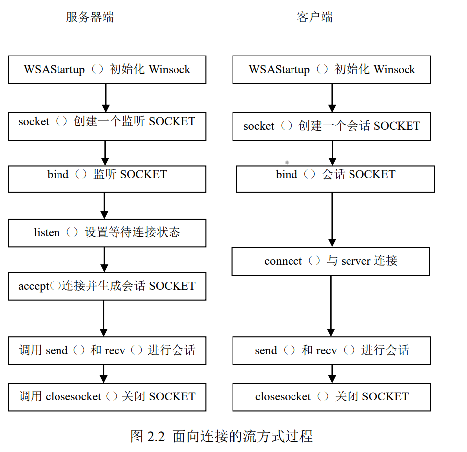

# 基于Socket编程的WebServer

## 1.intro

网络应用程序是由通信进程对组成，每对互相通信的应用程序进程互相发送报文，他们之间的通信必须通过下面的网络来进行。为了将应用程序和底层的网络通信协议屏蔽开来，采用套接字（Socket）这样一个抽象概念来作为应用程序和底层网络之间的应用程序编程接口（API）。因为网络应用程序是进程之间的通信，为了唯一的标识通信对等方的通信进程，套接字必须包含 2 种信息：

**(1) 通信对等方的网络地址。(2) 通信对等方的进程号，通常叫端口号。**

在 Windows 操作系统下，提供了一套网络通信协议的开发接口，称为 **Windows Sockets** 或简称 **Winsock**。

## 2.实验设计

- Web应用的运输层协议是**TCP**，因此一个Web Server需要使用面向连接的流式套接字——即先建立连接再进行数据交换，程序流程图如下图所示：

这里SOCKET的初始化、bind、listen比较固定，主要的设计部分是：WebServer对**HTTP请求报文的解析**以及**HTTP响应报文的构建**

### 2.1  **HTTP请求报文的解析**

该lab1中只使用了请求报文的首部：**方法**、**URL**、**HTTP版本**

1. 由于绝大部分的HTTP请求报文使用GET方法，因此这里只考虑GET作为合法的方法。
2. URL带有请求字段的标识，也就是Web服务器目录下的文件路径：例如:/helloworld.html
3. HTTP版本一般为HTTP/1.1（该字段使用正则表达式判断是否合法）

### 2.2  **HTTP响应报文的构建**

响应报文参考《计算机网络：自顶向下方法》（原书第七版）69页的响应报文格式设计

## 3.More Work

做完基于ipv4的WebServer后，在校园网条件下测试均可以正常访问，但是使用手机移动网络无法访问？也就是遇到了外网无法访问内网的问题。为什么不能通过ipv4地址访问服务器呢？

- 其实局域网环境下分配的ipv4地址往往是**互联网提供商的内网地址(提供商为了解决ipv4公网地址短缺，使用NAT技术方式，给用户分配由提供商组建的大型局域网的ip地址，通常格式为10.X.X.X。) 而NAT技术的一个巨大的缺点就是：外网主机无法主动访问内网主机(而我们的Web Server恰恰需要这样的功能，即客户机主动访问Web Server)**

解决的方法也有很多：我这里选择使用ipv6作为解决方案

ipv6的Web Server与ipv4差别不大，主要是引入了支持 sockaddr_in6 的头文件 ws2tcpip.h

在运行ipv6程序时，需要确保你的运营商提供ipv6地址以及DNS服务器是否接入ipv6网络，可以在[http://testipv6.cn/](http://testipv6.cn/) 上进行测试。（校园网并不支持DNS-ipv6，可以使用个人热点，各大运营商开启了ipv6的相关服务）

万事俱备之后，就可以在Web上访问自己的服务器了！

访问格式：

- ************************************ipv4 : XX.XX.XX.XX/helloworld.html  （在ip后加‘:port’可以指定端口号，默认80）************************************
- **************ipv6:[XXXX.XXXX.XXXX.XXXX.XXXX.XXXX.XXXX.XXXX]/helloworld.html**************
